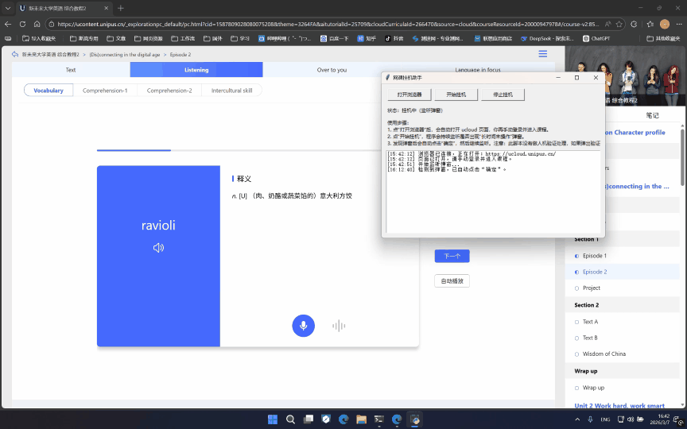

# U校园CNM😡

一个用于辅助监听 U校园Ai版学习页面“长时间未操作”提示弹窗的小工具（Windows）。

程序基于 `tkinter` 提供界面，使用 `DrissionPage` 控制浏览器并自动点击弹窗中的“确定”按钮。

## 功能

- 图形界面操作（打开浏览器、开始挂机、停止挂机）
- 自动检测并点击提示弹窗“确定”
- 自动/手动配置浏览器路径，并保存到本地配置
- 挂机期间尝试防止系统休眠与息屏
- 日志窗口实时显示运行状态

## 运行环境

- 操作系统：Windows
- Python：3.8 及以上（推荐 3.10+）
- 浏览器：Microsoft Edge 或 Google Chrome（可执行文件路径可配置）

## 安装依赖

在项目目录执行：

```powershell
pip install DrissionPage
```

## DEMO



## 使用方法

1. 运行脚本：

```powershell
python "U校园cnm.py"
```
（或者从 [GitHub Release v1.3](https://github.com/XtSilan/U-cnm/releases) 下载打包好的 exe）

2. 点击“打开浏览器”，程序会打开 `https://ucloud.unipus.cn/`。
3. 在浏览器中手动登录并进入课程学习页面（建议学习vocabulary）。
4. 点击“开始挂机”，程序会持续监听“长时间未操作”弹窗并自动点击“确定”。
5. 完成学习后点击“停止挂机”或直接关闭程序。

## 浏览器路径配置说明

- 程序会先尝试读取已保存路径。
- 若未保存，会尝试以下常见路径：
  - `C:\Program Files (x86)\Microsoft\Edge\Application\msedge.exe`
  - `C:\Program Files\Microsoft\Edge\Application\msedge.exe`
  - `C:\Program Files\Google\Chrome\Application\chrome.exe`
  - `C:\Program Files (x86)\Google\Chrome\Application\chrome.exe`
- 若仍失败，会弹出文件选择框让你手动选择浏览器 `.exe`。
- 配置文件保存位置：`%APPDATA%\HangUpApp\browser_path.txt`

## 注意事项

- 本工具不处理验证码、人机校验等场景，出现相关验证需手动处理。
- 仅自动点击指定提示弹窗，不保证所有学习场景都适配。
- 请合理使用，遵守所在平台课程与考试相关规定。

## 常见问题

### 1. 点击“打开浏览器”失败

- 检查是否已安装 Edge/Chrome。
- 手动选择正确的浏览器可执行文件（`.exe`）。
- 确认 `DrissionPage` 已安装。

### 2. 程序没有自动点“确定”

- 确认当前页面确实出现了“由于你长时间未操作，请点确定继续使用。”提示。
- 页面结构变更可能导致定位失效，需要更新脚本中的 XPath。

### 3. 防休眠没有生效

- 可能受系统策略、权限或第三方电源管理软件影响。
- 不影响弹窗监听主流程。

### 4.长时间未弹出确认窗口

- 由于网络波动导致Unipus的`stop`请求失败，连接状态变为`STATE_ERROR`此时`stop_auto`不会触发，导致不会弹窗也无法记录时长。
  - 解决办法: 程序设定40分钟未检测到弹窗自动刷新页面重新计时(可能丢失部分学习时长)。
- 可能浏览器处于最小化状态，自动进入节流模式，定时器精度被限制，`timeout`时间被拉长。
  - 解决办法: 将浏览器至于前台。

## 文件说明

- `U校园cnm.exe`：可从 [GitHub Release v1.3](https://github.com/XtSilan/U-cnm/releases) 下载

- `U校园cnm.py`：主程序文件

## 更新日志

- v1.0: 提交仓库
- v1.1: 增加浏览器保活，改善最小化后台冻结
- v1.2: 新增连接存活检测,修复检测连接逻辑,增加校验连接
- v1.3: 新增`error`状态自动刷新页面